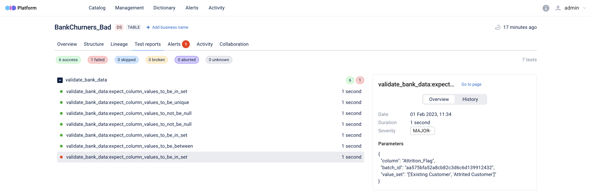

## OpenDataDiscovery Action for handling Great Expectations tests results.

[](https://badge.fury.io/py/odd-great-expectations)



# What is it?
`odd_great_expectation.action.ODDAction`
Is a class derived from GX `ValidationAction` which will be run by GreatExpectations at runtime with `ValidationResult`s for checkpoint.


# How to use it?:
Install `odd-great-expectations` package
```bash
pip install odd-great-expectations
```
Add `ODDAction` action to some checkpoint's action list:
```yaml
name: <CHECKPOINT_NAME>
config_version: 1.0
...
action_list:
  # other actions
  - name: store_metadata_to_odd
    action:
      module_name: odd_great_expectations.action
      class_name: ODDAction
      platform_host: <PLATFORM_HOST>
      data_source_name: <DATA_SOURCE_NAME>
```

Parameters:

`platform_host` - Location of OpenDataDiscovery platform, i.e. http://localhost:8080

`platform_token` - OpenDataDiscovery token, how to get it - https://docs.opendatadiscovery.org/configuration-and-deployment/trylocally#create-collector-entity

`data_source_name` - Unique name for data source, i.e. local_qa_test

Both `platform_host` and `platform_token`  can be set using `ODD_PLATFORM_HOST` and `ODD_PLATFORM_PLATFORM` env variables accordingly.

Run checkpoint
```bash
great_expectations checkpoint run <CHECKPOINT_NAME>
```
Check results on `PLATFORM_HOST` UI.

## Supporting features
| Feature                     | Supporting |
| --------------------------- | ---------- |
| V3 API +                    | +          |
| SqlAlchemyEngine            | +          |
| PandasEngine                | +          |
| Great Expectations V2 API - | -          |
| Cloud Solution              | -          |
